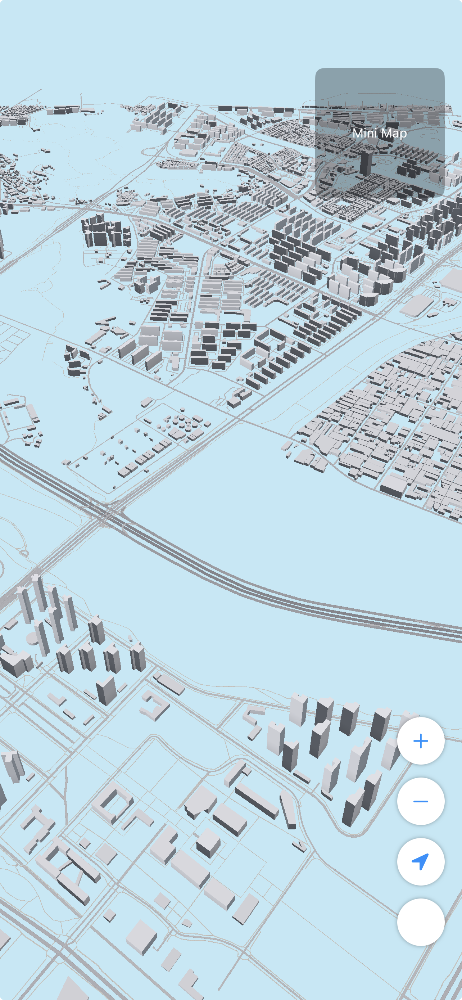

# Songdo 3D Map

인천 송도 지역을 3D로 시각화하는 iOS 앱입니다. OpenStreetMap 데이터를 기반으로 건물과 도로를 Metal 렌더링으로 표현합니다.

<p align="center">
  
</p>

## 주요 기능

- **3D 지도 렌더링**: Metal 기반 실시간 3D 건물/도로 렌더링
- **청크 기반 로딩**: 500m 단위 청크로 효율적인 데이터 로딩
- **탭 선택**: 건물/도로를 탭하여 상세 정보 확인 (이름, 높이, 폭 등)
- **위치 추적**: GPS 기반 현재 위치 표시
- **카메라 컨트롤**: 팬, 줌, 회전 제스처 지원

## 기술 스택

- **Swift 6.0** / **SwiftUI**
- **Metal** (3D 렌더링)
- **CoreLocation** (위치 서비스)
- **Python 3** (데이터 전처리)

## 프로젝트 구조

```
Songdo3DMap/
├── App/                    # 앱 진입점
├── Core/
│   ├── Renderer/          # Metal 렌더러
│   │   └── Shaders/       # Metal 셰이더
│   ├── Selection/         # 탭 선택 (Ray Casting)
│   └── Spatial/           # 청크 관리
├── Data/
│   ├── Loaders/           # 청크 로더
│   └── Models/            # 데이터 모델
├── UI/
│   └── Views/             # SwiftUI 뷰
├── Resources/
│   └── MapData/           # 청크 바이너리 데이터
└── Preprocessing/
    └── Scripts/           # Python 전처리 스크립트
```

## 빌드 방법

### 요구사항

- Xcode 16.0+
- iOS 18.0+
- Python 3.x (데이터 재생성 시)
- [XcodeGen](https://github.com/yonaskolb/XcodeGen)

### 빌드

```bash
# Xcode 프로젝트 생성
xcodegen generate

# Xcode에서 빌드 또는
xcodebuild -project Songdo3DMap.xcodeproj -scheme Songdo3DMap -destination 'platform=iOS Simulator,name=iPhone 16 Pro' build
```

## 데이터 전처리

OSM 데이터를 재추출하거나 업데이트하려면:

```bash
cd Songdo3DMap/Preprocessing/Scripts

# 1. OSM 데이터 추출 (Overpass API)
python3 osm_extractor.py -o output/osm

# 2. 청크 데이터 생성
python3 chunk_builder.py -i output/osm -o output/chunks

# 3. Resources로 복사
cp output/chunks/index.json ../../Resources/MapData/
cp output/chunks/chunks/*.bin ../../Resources/MapData/chunks/

# 4. Xcode 프로젝트 재생성
cd ../../..
xcodegen generate
```

## 데이터 현황

- **건물**: 7,654개
- **도로**: 6,333개
- **청크**: 361개 (500m x 500m)
- **커버리지**: 약 72km² (송도 전역)

## 라이선스

이 프로젝트는 개인 프로젝트입니다.

지도 데이터: © OpenStreetMap contributors
